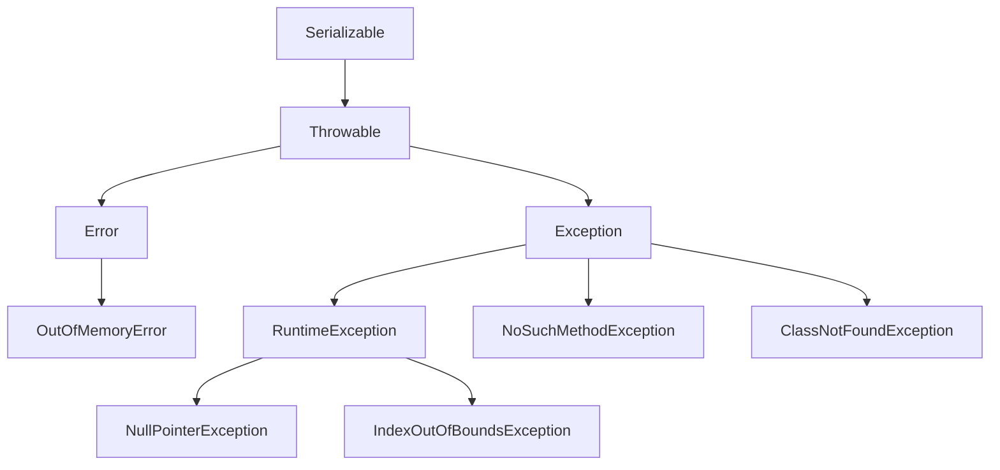

### 第1章 Java基础知识
#### 1.3 其他特性
### 1.3.1 请对比一下Java和JavaScript的区别

难度指数：★★

考查频率：20%

开发年限：0~1年

视频解说：Tom

匹配岗位：初级开发工程师

扫码看解说

一位应届毕业生在面试的时候把所有的“八股文”问题都答对了。没想到，有位面试官出了个奇招，面试官说了一句，请对比一下Java和JavaScript的区别。像这样入门级别的问题，应该每一个后端开发人员都能答吧。更没想到，这位应届毕业生竟然没有答出来，还说JavaScript是对Java的升级。这样的回答，实在是有点不应该。下面给大家总结一下Java和JavaScript的异同之处。


首先总结两者的不同之处，从以下4个方面来进行分析。

1. **产生背景不同**

最初Java语言是由Sun公司研发的，前身叫Oak语言，1995年5月正式对外发布并开源。而JavaScript是Netscape（网景）公司的产品，最初被命名为LiveScript，是为了扩展Netscape浏览器的功能而开发的解释性语言。因为Netscape与Sun合作，Netscape公司管理层希望它外观看 起来像Java，因此更名为JavaScript。

2. **对象设计不同**

Java是一种真正的面向对象的语言，即使开发简单的程序，也必须设计对象；而JavaScript是脚本语言，可以用来开发与网络无关的、与用户交互的复杂软件。JavaScript是一种基于对象（Object - Based）和事件驱动（Event - Driven）的编程语言，它内置了非常丰富的对象供开发人员使用。

3. **运行机制不同**

Java的源码在执行之前必须经过编译，而JavaScript是一种解释性编程语言，源码不需要经过编译，直接由浏览器解释执行。目前的浏览器几乎都使用了JIT（即时编译）技术来提升JavaScript的运行效率。


4. **变量定义不同**

Java采用强类型变量检查，也就是说，所有的变量在编译之前必须先声明；而JavaScript中的变量是弱类型的，甚至在使用前变量都可以不声明。JavaScript的解释器会在运行时自动判断数据类型。


当然，Java和JavaScript也很多相同之处，从以下几个方面来分析。

1）Java和JavaScript的语法都和C语言相似。

2）二者都是面向对象的。虽然实现的方式略有不同，但是JavaScript在设计时参照了Java的命名规则。


最后总结一下，JavaScript除了名字长得和Java比较像，它们的语言风格相差非常大。JavaScript在设计时不仅参考了Java，还参考了Self和Scheme等其他语言。所以，Java和JavaScript各有所长、各有专精，Java的舞台在编程领域，而JavaScript的得心应手之处是在Web页面中，它几乎无所不能。

**面试点评**

上面列出的相同点和不同点都是在网上流传的标准答案。Java和JavaScript最重要的区别在于：JavaScript是静态语言，而Java是动态语言。编程语言目前的发展趋势是函数式语言和动态语言。在Java中，类（Class）是“一等公民”；而在JavaScript中，函数（Function）是“一等公民”。因此JavaScript支持函数式编程，可以使用Lambda函数和闭包（closure）。

当然，Java 8也开始支持函数式编程，并提供了对Lambda表达式及函数式接口的支持。

对这类问题，在面试的时候最好还是用自己的语言回答更加靠谱，不要背网上的标准答案。


### 1.3.2 什么是受检异常和非受检异常
难度指数：★★★★★

考查频率：50%

开发年限：1~3年

视频解说：Mic

匹配岗位：中级开发工程师

扫码看解说


受检异常，表示在编译的时候强制检查的异常，这种异常需要显式地通过try/catch来捕捉，或者通过throws抛出，否则程序无法通过编译，如下图所示。而非受检异常，表示编译器不需要强制检查的异常，这种异常不需要显式地捕捉。

```java
public class ThreadExceptionExample {
    public static void main(String[] args) {
        Thread.sleep(1000);
    }
}
```


如上图所示，在Java里面，所有的异常都继承自java.lang.Throwable类，Throwable有两个直接子类——Error和Exception。





Error用来表示程序底层或者硬件相关的错误，这种错误和程序本身无关，比如常见的OOM异常。因为这种异常和程序本身无关，所以不需要检查，属于非受检异常。

Exception表示程序中的异常，可能是由于程序不严谨导致的，比如NullPointerException。

Exception下面派生了RuntimeException和其他异常，其中RuntimeException是运行时异常，也属于非受检异常。

所以，除了Error和RuntimeException及派生类，其他异常都属于受检异常，比如IOException、SQLException。

之所以在Java中要设计一些强制检查的异常，主要原因是要考虑程序的正确性、稳定性和可靠性。

比如数据库异常、文件读取异常，这些异常是程序无法提前预料的，但是一旦出现问题，就会造成资源被占用，导致程序出现问题。所以我们需要主动捕获这些异常，从而在异常情况下可以做出对应的处理，比如关闭数据库连接、释放文件流等。

**面试点评**

其实这个问题并不难，涉及的知识点比较基础，却难倒了很多人。在实际工作中，用好异常很重要。

从上面的回答中可以明显看到，求职者对异常的理解是比较深入的，分别介绍了受检和非受检异常，以及这两种异常在Java中是如何分类的，最后说明了这两种异常的价值。


### 1.3.3 fail - fast机制与fail - safe机制分别有什么作用

难度指数：★★★★★

考查频率：45%

开发年限：1~3年

视频解说：Mic

匹配岗位：中级开发工程师

扫码看解说


fail - fast和fail - safe是多线程并发操作集合时的失败处理机制。

fail - fast表示快速失败，在集合遍历过程中，一旦发现容器中的数据被修改了，会立刻抛出ConcurrentModificationException，从而导致遍历失败。像下面程序这种情况，定义一个Map集合，使用Iterator进行数据遍历，在遍历过程中，对集合数据做变更时，就会发生fail - fast。java.util包下的集合类都是fail - fast机制的，常见的使用fail - fast方式遍历的容器有HashMap和ArrayList等。

```java
public static void main(String[] args) {
    Map<String, String> empName = new HashMap<String, String>();
    empName.put("name", "mic");
    empName.put("sex", "male");
    empName.put("age", "18");
    Iterator iterator = empName.keySet().iterator();
    while (iterator.hasNext()) {
        System.out.println(empName.get(iterator.next()));
        empName.put("work", "Java");
    }
}
```

以上程序的运行结果如下：
```
male
Exception in thread "main" java.util.ConcurrentModificationException
at java.util.HashMap$HashIterator.nextNode(HashMap.java:1445)
at java.util.HashMap$KeyIterator.next(HashMap.java:1469)
at org.example.c109.ThreadExample.main(ThreadExample.java:14)
```

fail - safe表示失败安全，也就是在这种机制下，出现集合元素的修改不会抛出ConcurrentModificationException。原因是采用fail - safe机制的集合容器，在遍历时不是直接在集合内容上访问的，而是先复制原有集合内容，在复制的集合上进行遍历。由于迭代时是对复制的集合进行遍历，所以在遍历过程中对原集合所做的修改并不能被迭代器检测到。

再比如以下这段代码，定义一个CopyOnWriteArrayList，在对这个集合进行遍历的过程中，对集合元素做修改后，不会抛出异常，但同时也不会打印出增加的元素。

```java
public static void main(String[] args) {
    CopyOnWriteArrayList<Integer> list
            = new CopyOnWriteArrayList<>(new Integer[]{1, 7, 9, 11});
    Iterator itr = list.iterator();
    while (itr.hasNext()) {
        Integer i = (Integer) itr.next();
        System.out.println(i);
        if (i == 7) list.add(15); //在fail - safe模式下，这里不会被打印
    }
}
```

java.util.concurrent包下的容器都是fail - safe机制的，可以在多线程下并发使用、并发修改。常见的使用fail - safe方式遍历的容器有ConcurrentHashMap和CopyOnWriteArrayList等。

**面试点评**

面试官想通过这个问题考查求职者对Java并发编程的理解，以及对Java集合框架的底层实现原理的理解。

一些刚入行的小伙伴，很容易因为这个问题犯错误，导致出现一些Bug，最后虽然解决了，但是并不清楚底层原因。其实搞懂原理后，会发现这个问题并不难，也能很好地规避代码上的风险。

### 1.3.4 如何理解序列化和反序列化

难度指数：★★★★★

考查频率：60%

开发年限：1~3年

视频解说：Mic

匹配岗位：中级开发工程师、高级开发工程师

扫码看解说


一个工作了4年的小伙伴投了很多简历，好不容易接到一个互联网公司的面试邀约，在面试第一轮就被“干掉了”，原因是对主流互联网技术的理解太浅了。

关于这个问题，大家可以从以下几个方面来回答。 


### 1.3.4 如何理解序列化和反序列化

难度指数：★★★★★

考查频率：60%

开发年限：1~3年

视频解说：Mic

匹配岗位：中级开发工程师、高级开发工程师

扫码看解说


一个工作了4年的小伙伴投了很多简历，好不容易接到一个互联网公司的面试邀约，在面试第一轮就被“干掉了”，原因是对主流互联网技术的理解太浅了。
关于这个问题，大家可以从以下几个方面来回答。

首先，之所以需要序列化，核心目的是解决网络通信中的对象传输问题。也就是说，如何把当前JVM进程里的一个对象，跨网络传输到另外一个JVM进程里。序列化，就是把内存里面的对象转化为字节流，以便用来实现存储或传输。反序列化，就是根据从文件或者网络上获得的对象的字节流，根据字节流里保存的对象描述信息和状态重新构建一个新的对象。


其次，序列化的前提是保证通信双方对于对象的可识别性，所以很多时候，我们会把对象先转化为通用的解析格式，比如JSON、XML等，再把它们转化为数据流进行网络传输，从而实现跨平台和跨语言的可识别性。


最后，市面上开源的序列化技术非常多，比如JSON、XML、Protobuf、Kryo、Hessian等，在实际应用里选择哪种序列化技术合适，需要考虑以下因素。

1）序列化之后的数据大小，因为数据大小会影响传输性能。

2）序列化的性能，序列化耗时较长会影响业务的性能。

3）是否支持跨平台和跨语言。

4）技术的成熟度，越成熟的方案使用的公司越多，也就越稳定。


**面试点评**

面试官想通过这个问题考查求职者对Java序列化的理解，同时可以延展到Java网络编程、分布式架构等方面的知识点。

这个问题，再深入一点，还会涉及序列化的算法和原理。在实际开发中，对序列化技术的选择在性能方面的影响也是比较大的，因此互联网公司对这方面的考查会多一些。


### 1.3.5 什么是SPI，它有什么用

难度指数：★★★★★

考查频率：20%

开发年限：3~5年

视频解说：Mic

匹配岗位：中级开发工程师、高级开发工程师

扫码看解说


SPI，全称是Service Provider Interface，是一种基于接口的动态扩展机制，Java SPI相当于Java里面提供了一套接口，然后第三方可以实现这个接口来完成功能的扩展。

简单来说，我们可以定义一个标准接口，然后第三方的库可以实现这个接口。那么，程序在运行的时候，会根据配置信息动态加载第三方实现的类，从而完成功能的动态扩展。


在Java中，SPI机制有一个非常典型的实现案例，就是数据库驱动java.jdbc.Driver。


JDK里面定义了数据库驱动类Driver，它是一个接口，JDK并没有提供实现，比如Oracle是oracle.jdbc.OracleDriver，MySQL是com.mysql.jdbc.Driver。在开发的时候，根据集成的驱动实现连接到对应数据库。这些实现是由第三方数据库厂商完成的。程序在运行的时候，会根据我们声明的驱动类型，动态加载对应的扩展实现，从而完成数据库的连接。

除此之外，很多开源框架都借鉴了Java SPI的思想，提供了自己的SPI框架，比如Dubbo定义了ExtensionLoader，实现功能的扩展；Spring提供了SpringFactoriesLoader，实现外部功能的集成。Java SPI机制的主要思想是将装配的控制权移到程序之外，做到标准和实现的解耦，以及提供动态可插拔的能力。在模块化的建设中，这种思想非常重要。

实现Java SPI需要满足几个基本的格式：

1）需要定义一个接口，作为扩展的标准。

2）在classpath目录下创建META - INF/service目录。

3）在创建的目录下，以接口的全限定名命名配置文件，文件内容是这个接口的实现类。

4）在应用程序里，使用ServiceLoad就可以根据接口名称找到classpath所有的扩展实现，然后根据上下文场景选择实现类完成功能的调用。


Java SPI有一定的不足之处，比如，不能根据需求加载需要的扩展实现，每次都会加载扩展接口的所有实现类并进行实例化，实例化会造成性能开销，并且加载一些不需要用到的实现类会导致内存资源的浪费。


**面试点评**

这个问题的考查难度偏中等，对于没怎么研究过源码的小伙伴来说，SPI是非常陌生的概念。工作3~5年的开发者属于中高端Java开发者，因此考查目的也很明显：

- 了解求职者对于技术的理解程度；

- 实现对高级开发工程师的人才选拔。

Java领域没有人才评级标准，在面试的时候，面试官也较难界定求职者的职级。所以互联网企业对技术的考查会比较深入。要想回答好这个问题，还是要有一些自己的见解。

### 1.3.6 finally语句块一定会执行吗

难度指数：★★

考查频率：60%

开发年限：1~3年

视频解说：Mic

匹配岗位：中级开发工程师

扫码看解说


finally语句块在实际开发中使用得非常多，它是和try语句块组合使用的。通常情况下，不管有没有触发异常，finally语句块中的代码都是必然会执行的。所以我们会把资源的释放或者业务日志的打印放在finally语句块里。所以，当大家把这个理念当成固定的公式以后，就很少会思考finally语句块在什么情况下不执行。finally语句块在以下两种情况下不执行：

1）程序没有进入try语句块而因为异常导致程序终止，出现这个问题的原因主要是开发人员在编写代码的时候，异常捕获的范围不够。

2）在try或者catch语句块中，执行了System.exit(0)语句，导致JVM直接退出。


**面试点评**

这个问题主要考查求职者的Java基础，但也难倒了很多求职者。这个问题主要考查两个方面：

1）对finally关键字的理解程度，其实就是考查Java基础，良好的Java基础能够让我们写出更加稳定和健壮的代码。

2）是否具有对技术的探索精神，具有探索精神的人在技术的成长速度上会比一般人快。


### 1.3.7 什么是内存溢出，什么是内存泄漏

难度指数：★★

考查频率：20%

开发年限：1~3年

视频解说：Tom

匹配岗位：中级开发工程师

扫码看解说


先来介绍什么是内存溢出，首先来看下面这张图。


我们来看右侧的区域，假设JVM中可用的内存空间只剩下3MB，但是我们要创建一个5MB的对象，那么新创建的对象就放不进去了。这个时候，就叫作内存溢出。就好比一个容量只有300ml的水杯，我们硬要往里面倒500ml的水，这时候，水就会溢出，倒不进去了。

那么，内存泄漏又是怎么回事呢？来看下面这张图。

它代表业务代码执行时所需要占用的内存空间。我们在业务代码中创建了两个1MB的对象，一起会占用2MB内存。当对象使用完之后，这两个对象并没有被释放，因此内存中会留下2MB的空间一直被占用。而我们的业务代码在程序中会被反复执行，每次执行都会留下2MB内存不被释放，反复执行多次之后，随着时间的累积，就会有大量的对象用完不被释放，导致这些对象不能得到回收而发生内存溢出，这种情况就叫作内存泄漏，内存泄漏最终也会导致内存溢出。

我们在编码过程中，特别是对于一些流对象，比如OutputStream、Reader、BitMap、Document，很容易忘了关闭。最麻烦的是还要按顺序回收，顺序错了会产生空指针，所以，大家在编码过程中一定要注意，当然，现在有很多IDE会智能提示，也避免了很多低级错误。

**面试点评**


内存泄漏和内存溢出在生产环境中也是偶尔会出现的问题，不管是因为内存分配比例太小，还是因为程序上存在Bug，我们都需要具备解决这类问题的能力。所以这也是面试官重点考查的内容。 


